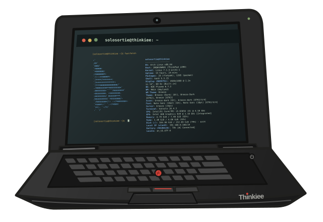

# LoneMagma

<picture>
  <source media="(prefers-color-scheme: dark)" srcset="./assets/thinkiee-dark.svg">
  <source media="(prefers-color-scheme: light)" srcset="./assets/thinkiee.svg">
  
</picture>

I make little pieces of software until they feel alive.

They usually begin as something I want to use and understand, or stop being annoyed at. I build first. ask the questions, and learn my way through when something breaks.

Currently, [a 302-neuron worm is learning Snake](https://wormlearns.pacify.site).

[Pacify site](https://pacify.site/) holds the rest of my little workshop.

---

That’s **Thinkiee** on the right. my ThinkPad L490 and companion on the journey.  

 
