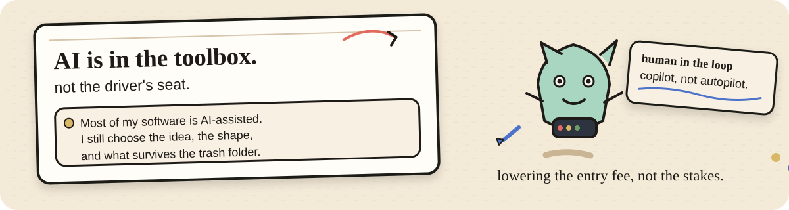

  

 

  <h1>Lone</h1>
  <strong>I make software. Sometimes it makes me ( ^ ◡ ^ ).</strong> 
  tools for personal use, information, practice, and software that occasionally feel a little too alive.

  <a href="https://pacify.site"><strong>Pacify</strong></a>
  &nbsp; · &nbsp;
  <a href="https://github.com/LoneMagma?tab=repositories"><strong>things I made</strong></a>
  &nbsp; · &nbsp;
  <a href="https://github.com/LoneMagma/FreeShelf"><strong>FreeShelf</strong></a>
  &nbsp; · &nbsp;
  <a href="https://github.com/LoneMagma/Jen1"><strong>Jen1</strong></a>

  

## Come in.

I like taking a vague thought and giving it a keyboard, a screen, and a chance to misbehave.

Some projects are useful on The day one. Some are glorified experiments with surprisingly long names XD. A few are still sitting on the desk asking me what they want to become-

The recurring questions are pretty simple:

> Can software help us reclaim our attention?
>
> Can a mountain loads of information become one useful thing?
>
> Can a piece of code feel like an delibrate presence instead of another tab asking for attention?

  

## The workshop

### Finding things

| Project | What it is | Where it lives |
|---|---|---|
| [**FreeShelf**](https://freeshelf.pacify.site) | Finds free PC games, tracks prices and historical lows, compares storefronts, and tries to stop you buying something five minutes before it becomes free. | web app |
| [**Jen1**](https://jen1.pacify.site) | A movie discovery app built around browsing, searching, metadata, playback, and that oddly satisfying moment when you finally find something worth watching. | web app |

### Training the human

| Project | What it is | Where it lives |
|---|---|---|
| [**FocusED**](https://github.com/LoneMagma/FocusED) | Adds friction to distracting apps with pauses, intent checks, limits, downtime, and reflection. No streak worship. | Android |
| [**Intention**](https://github.com/LoneMagma/intention--extension) | Lets you use Instagram on purpose while getting in the way of the feed-shaped rabbit holes. | browser extension |
| [**PrepZero**](https://github.com/LoneMagma/PrepZero) | Gives you an impromptu speaking prompt, a moment to think, then recording, transcription, and review. | web tool |
| [**Key4ce**](https://github.com/LoneMagma/Key4ce) | Terminal-first typing practice with local sessions, goals, progress, and enough numbers to make the keyboard feel accountable. | terminal tool |
| [**Poscure**](https://github.com/LoneMagma/Poscure) | A local timed figure and gesture drawing tool. Bring your own references, set a timer, draw. No account. No cloud. | local tool |

  

### Making the computer feel inhabited

| Project | What it is | Where it lives |
|---|---|---|
| [**SOUL**](https://github.com/LoneMagma/SOUL) | An ambient desktop agent that can see context, act on the machine, remember things, and occasionally decide it has an opinion about what is happening. | desktop experiment |
| [**Pacificia**](https://github.com/LoneMagma/Pacificia) | A terminal AI companion with memory, mood, personas, contextual callbacks, and personality. | terminal experiment |
| [**Pacify / DefyAI**](https://github.com/LoneMagma/Pacify-DefyAI) | A CLI experiment with two conversational modes: one cooperative, one deliberately more direct. | CLI experiment |
| [**ShellNote**](https://github.com/LoneMagma/shellnote) | A terminal-native thinking space with Vim-style movement, persistent notes, themes, and an AI companion called Sage. | terminal tool |

  

## AI and authorship

  

Yes, I use AI. A lot.

Pretending otherwise would make this page less honest, not more impressive.

Most of my software has been AI-assisted in one way or another. Sometimes that means help with a stubborn functions. Sometimes it means turning a half-formed idea into a rough first version. Sometimes the machine gets to do a frankly irresponsible amount of typing while I sit there pointing at things and saying, no, not like that.

I do not see AI as a replacement for learning. I see it as a weird tool that lowers the cost of getting started. I am not following a perfectly ordered learning path, and without that lower barrier, some of these projects probably would have stayed as notes, tabs, or ideas I kept "meaning to build someday" when I had learnt the perfect way to code them.

The intent still has to come from somewhere {me! (^ ^)/}. I choose what to make, what to keep, what to throw away, what feels wrong, what should exist, and what the machine completely misunderstood. I still debug. I still redraw. I still make bad decisions. The AI just makes the distance between

> "I have an idea."
>
> and
>
> "there is a weird little prototype on my screen."

much shorter.

So yes, the robot helped.

The author is still responsible for the mess.

### Owning the environment

| Project | What it is |
|---|---|
| [**BurnLab**](https://github.com/LoneMagma/BurnLab) | Turns a USB drive into a portable, air gapped AI development environment. Your tools travel with you. The host machine gets to mind its own business. |

## A couple of blank shelves

[**graphiic**](https://github.com/LoneMagma/graphiic) and **purrpause** stay lightly labelled for now. Their public material is not enough for me to write a confident description- to simply put it. IN Development

## The repeating bits

  <table>
    <tr>
      <td align="center"><strong>ATTENTION</strong> FocusED · Intention · PrepZero · Key4ce · Poscure</td>
      <td align="center"><strong>INFORMATION</strong> FreeShelf · Jen1 · NewZ</td>
      <td align="center"><strong>COMPUTING</strong> SOUL · Pacificia · Pacify / DefyAI · ShellNote · BurnLab</td>
    </tr>
  </table>

I keep circling the same questions from different angles.

How much control should the person have?

What happens when too much information becomes useful information?

What if the computer remembers, notices, or acts instead of just waiting for another click?

## Currently on the desk

**FreeShelf** and **Jen1** are the clearest active web projects right now. The rest are still useful to me as tools, experiments, or evidence from earlier rabbit holes.

I have learned to leave a few rabbit holes open lol

  

## A note to self

I tend to build first and explain later.

This has produced some good software, some weird software, and a fairly impressive collection of folders named `final`, `final2`, and `final-real-this-time` eating dust in the downloads.

I still am keeping the naming convention for historical reasons.

## Links on the wall

  <a href="https://pacify.site">Pacify</a>
  &nbsp; · &nbsp;
  <a href="https://github.com/LoneMagma?tab=repositories">all repos</a>
  &nbsp; · &nbsp;
  <a href="https://github.com/LoneMagma">GitHub</a>

  

still building AND occasionally breaking things with confidence

Signing off

