

  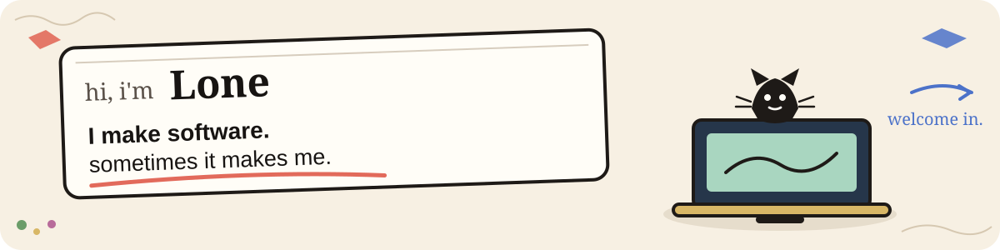

 

  <strong>software, experiments, and small machines for thinking.</strong> 
  I like building tools that help people focus, discover, practice, remember, or make computers feel a little more alive.

 

  <a href="https://pacify.site"><strong>Pacify</strong></a>
  &nbsp;·&nbsp;
  <a href="https://github.com/LoneMagma?tab=repositories"><strong>Projects</strong></a>
  &nbsp;·&nbsp;
  <a href="https://github.com/LoneMagma/FreeShelf"><strong>FreeShelf</strong></a>
  &nbsp;·&nbsp;
  <a href="https://github.com/LoneMagma/Jen1"><strong>Jen1</strong></a>

  

## Welcome in.

I make software because I like turning vague ideas into things you can actually use.

Some projects are products. Some are experiments. Some are tools for practicing a skill. Some are explorations into what a computer could feel like when it has memory, personality, or a little more agency.

I do not really have one lane — I keep circling a few questions:

> **How can software help us act more deliberately?**  
> **How can information become more useful instead of louder?**  
> **How can a computer feel more like an instrument than another system asking for attention?**

 

  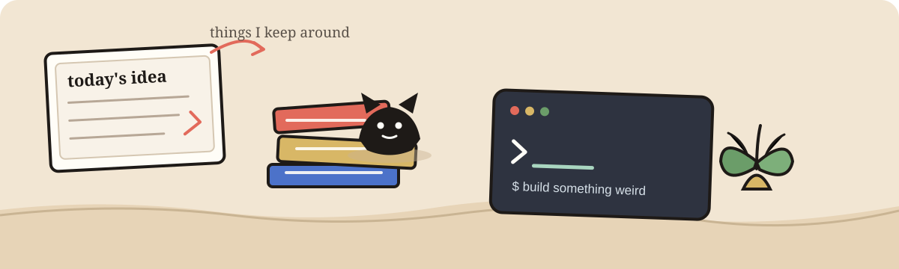

## The workshop

These are the things I keep on the desk.

### Finding things

| Project | What it is | Status |
|---|---|---|
| [**FreeShelf**](https://freeshelf.pacify.site) | Deal intelligence for PC games — free games, prices, discounts, historical lows, and storefront comparison. | `active` |
| [**Jen1**](https://jen1.pacify.site) | A cinematic movie discovery experience built around browsing, searching, metadata, playback, and presentation. | `active` |
| [**NewZ**](https://github.com/LoneMagma/NewZ) | A personalized news ranking system that extracts signals from many feeds and ranks what matters to you. | `experiment` |

  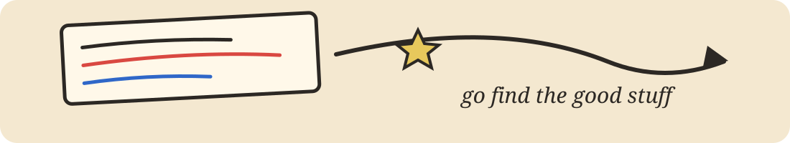

### Training the person

| Project | What it is | Status |
|---|---|---|
| [**FocusED**](https://github.com/LoneMagma/FocusED) | Android behavioural friction: pause, intent, wait — with app budgets, limits, downtime, focus mode, and reflection instead of streaks. | `developing` |
| [**Intention**](https://github.com/LoneMagma/intention--extension) | A browser extension that lets you use Instagram intentionally while interrupting feed-shaped loops. | `experiment` |
| [**PrepZero**](https://github.com/LoneMagma/PrepZero) | Impromptu speaking practice: prompt, think, speak, record, transcribe, review. | `experiment` |
| [**Key4ce**](https://github.com/LoneMagma/Key4ce) | A terminal-first typing practice instrument with local progress, sessions, goals, and analytics. | `experiment` |
| [**Poscure**](https://github.com/LoneMagma/Poscure) | A local-first timed gesture/figure drawing practice tool built around your own reference library. | `experiment` |

  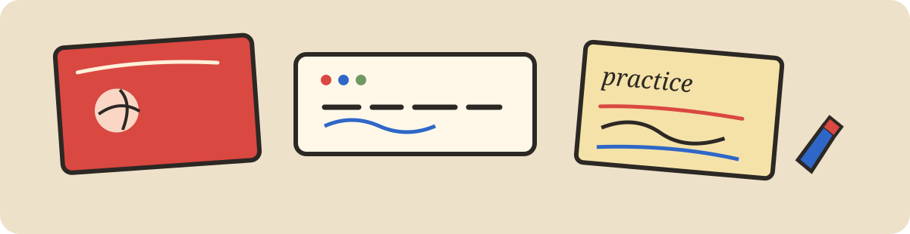

### Making the computer feel inhabited

| Project | What it is | Status |
|---|---|---|
| [**SOUL**](https://github.com/LoneMagma/SOUL) | An ambient desktop AI agent that can see context, act on the machine, remember, and proactively interact. | `major experiment` |
| [**Pacificia**](https://github.com/LoneMagma/Pacificia) | A terminal AI companion built around personality, memory, mood, personas, and contextual conversation. | `experiment` |
| [**Pacify / DefyAI**](https://github.com/LoneMagma/Pacify-DefyAI) | A CLI conversational AI exploring two styles of interaction: collaborative Pacify and direct Defy. | `experiment` |
| [**ShellNote**](https://github.com/LoneMagma/shellnote) | A terminal-native thinking environment with Vim-like navigation, persistent notes, themes, and an AI companion. | `tool` |

  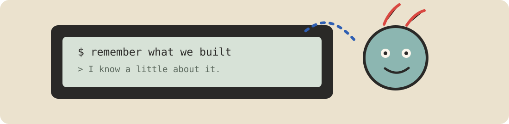

### Owning the environment

| Project | What it is | Status |
|---|---|---|
| [**BurnLab**](https://github.com/LoneMagma/BurnLab) | A portable, air-gapped AI development environment intended to live entirely from a USB drive. | `experiment` |

  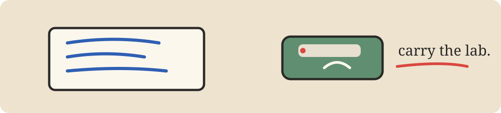

### A couple of shelves are still unlabeled

[**graphiic**](https://github.com/LoneMagma/graphiic) and **purrpause** are deliberately left less described here until their public/live material gives me enough evidence to describe them properly. I would rather leave a blank label than invent what a project is.

  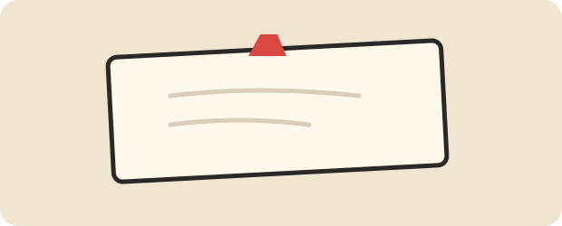

## What keeps repeating

  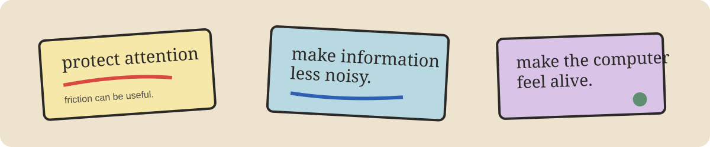

<table>
  <tr>
    <td width="33%" valign="top">
      <h3>Attention</h3>
      
FocusED, Intention, PrepZero, Key4ce, Poscure.

      
Tools that add structure or friction so the person stays in control.

    </td>
    <td width="33%" valign="top">
      <h3>Information</h3>
      
FreeShelf, Jen1, NewZ.

      
Ways of turning too much choice into something you can actually act on.

    </td>
    <td width="33%" valign="top">
      <h3>Computing</h3>
      
SOUL, Pacificia, Pacify / DefyAI, ShellNote, BurnLab.

      
Experiments in agency, memory, personality, local environments, and computer presence.

    </td>
  </tr>
</table>

## What is on the desk right now

  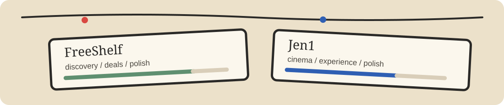

At the moment, **FreeShelf** and **Jen1** are the clearest active web projects. Everything else stays around as a trail of experiments, tools, and questions that fed the next thing.

## A little philosophy

  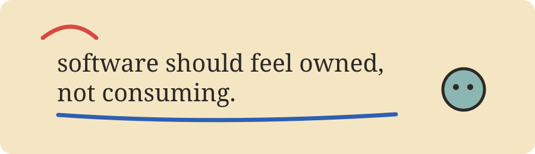

I like software that feels **owned rather than consuming**.

I like local-first tools, explicit interaction, useful friction, and interfaces that respect the person's attention.

I also like making things before I know exactly what they will become.

That is probably why there are so many shelves in this workshop.

## Come in through the front door

  <a href="https://pacify.site">pacify.site</a>
  &nbsp;&nbsp;·&nbsp;&nbsp;
  <a href="https://github.com/LoneMagma?tab=repositories">all repositories</a>
  &nbsp;&nbsp;·&nbsp;&nbsp;
  <a href="https://github.com/LoneMagma">GitHub</a>

  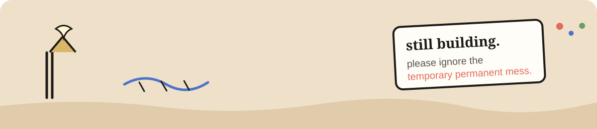

made by Lone · some things stay, some things teach me something.

