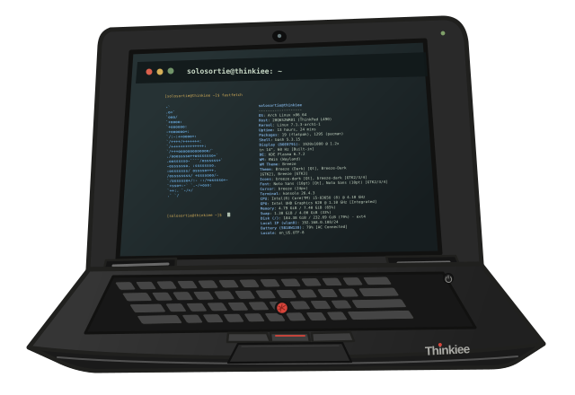

# Hey I'm Lone

<picture>
  <source media="(prefers-color-scheme: dark)" srcset="./assets/thinkiee-dark.svg">
  <source media="(prefers-color-scheme: light)" srcset="./assets/thinkiee.svg">
  
</picture>

I make little pieces of software!

They usually begin as something I want to use and/or understand.

Currently, Building a browser native First Person Shooter: KRAGE. [PLAY NOW](https://Krage.pacify.site)

Everything is under the [Pacify.site](https://pacify.site/) logo- My Tech Venture & Portfolio.

---

And That’s **Thinkiee** on the right. my ThinkPad and companion on this journey.

 
